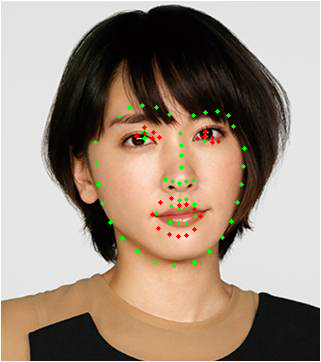

# face_point
experminal project

# install and training

- git clone "this repository"
- After execute install_files.sh move script files
- capture training material by apply_to_model.py *you're at the root directory"


```
python scripts/apply_to_model.py

```
1. saved raw image data and landmark datafiles under data directory
2. Training script 

```
python scripts/train_model.py

```

# Basic inference script
- webcam capture realtime face landmark

```
python scripts/realtime_tracking.py

```


# example face_synchronize.py

```
python scripts/face_synchronize.py

```

Original photo copyright reserved actress herself.

MIT License
Manyan3 
